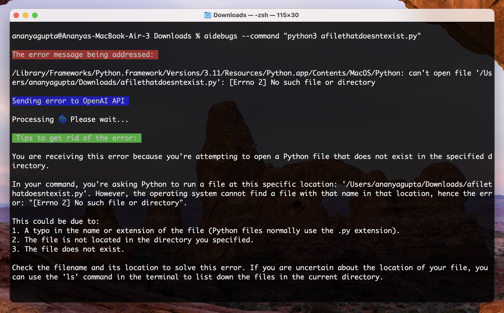

<div align="center">
  <div>
    <h1 align="center">aidebugs</h1>
  </div>
	<p>A CLI that debugs error messages produced in your command line by calling an LLM! </p>
	<a href="https://www.npmjs.com/package/aidebugs"></a>
  <p> Shoutout to <a href="https://github.com/Nutlope/aicommits"> aicommits </a> for the inspiration! </p>
  
</div>

## Setup

> Check your Node.js version with `node --version`. It should be at least v14!

1. Installation:

    ```sh
    npm install -g aidebugs
    ```

2. Get your API key from [OpenAI](https://platform.openai.com/account/api-keys)

    > Note: If you haven't already, you'll have to create an account and set up billing.

3. Set the key so aidebugs can use it:
    ```sh
    aidebugs config --key "<your-api-key>"
    ```

    This will create a `.aidebugs` file in your home directory.

### Upgrading

Check the installed version with:
```
aidebugs --version
```

If it's not the [latest version](https://www.npmjs.com/package/aidebugs), run:
```sh
npm update -g aidebugs
```

## Usage
### Send error message

Utilize the --command flag to specify a command for the terminal to execute. Any error output generated is then fed into the open ai api to get tips and ways to fix it! For example,

```sh
aidebugs --command "npm run dev"
```
<div align="center">
  
</div>

### Include files 

You can also include files for added context on understanding your error message using the --file flag. For example, including two files

```sh
aidebugs --command "python3 scripts/script1.py" --file "scripts/script1.py" "scripts/script2.py"
```

<div align="center">
  
</div>

### Specify file lines

You can also specify a range of file lines to include into your context instead of entire files. For example,

```sh
aidebugs --command "python3 scripts/script1.py" --file "scripts/script1.py:2-2" "scripts/script2.py"
```

<div align="center">
  
</div>

## Additions coming soon

- Be able to include custom prompts such as "I expected an output of 4 but got 5- what could the issue be?" instead of it just debugging when an error is hit. 
- Expanding on that, even using this as a debugging buddy! It's common to include print and logging statements in specific places to help understand where your code may have an issue- it would be cool to have this tool add these by itself to help the user debug their code! 
- Make it prettier using chalk and other tools 
